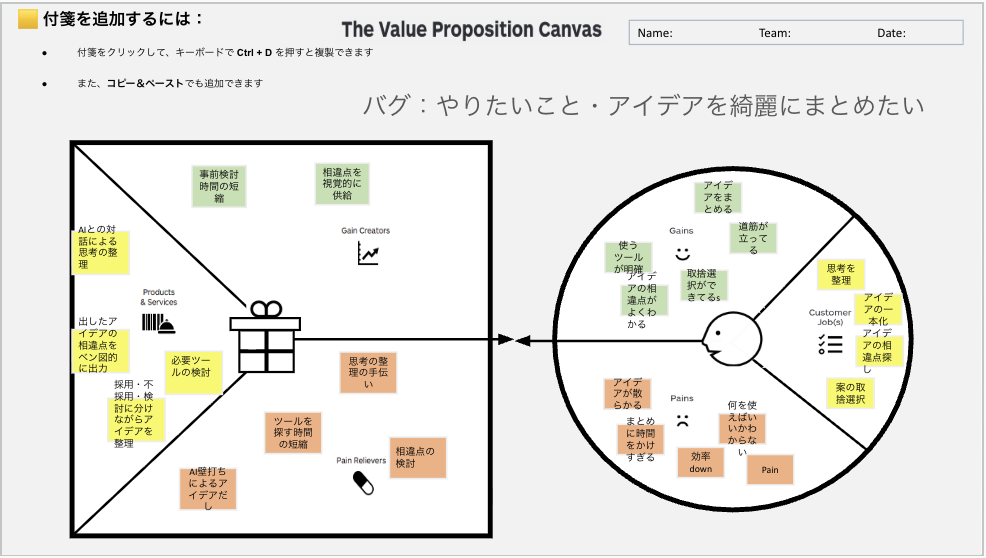

# VPC v1 - clara27

> 「**自分や周りの人を顧客に設定**」したVPC。13週後の自分が欲しいもの・身近な人のために作りたいものを設計する。
> v1 でいい。完璧を目指さない。第6回でアップデート(v2)します。

---

## 1. 解決したい困りごとを 1つ 選ぶ

> [`bug-list.md`](./bug-list.md) の20個から、**「自分が一番これを解決したい!」と思うもの** を1つ選んでください。
> 1つに絞れなければ、複数候補を書いてOK(後で絞り込みます)。

**選んだ困りごと**:

やりたいこと・アイデアを綺麗にまとめたい (バグ3. アイデアが散らかる / バグ14. どこから手をつければいいのかわからない / バグ18. 計画段階に時間を費やしすぎてしまう など)

---

## 2. その解決策のアイデアを書く

> 選んだ困りごとに対する「**こうだったらいいのに**」を1つ書く。
> 現実性は気にせず、自由に発想。

**解決のアイデア**:

AIとの対話や壁打ちにより思考を整理し、出したアイデアの相違点をベン図的に出力して、採用・不採用・検討に分けながらアイデアを整理・取捨選択するツール

---

## 3. VPC本体

> 上で選んだ「困りごと」と「解決のアイデア」を起点に、6要素を埋めていきます。

### 🟦 Customer Profile(顧客=自分自身)

#### Jobs(やりたいこと・動詞で書く)

- 思考を整理する
- アイデアを明確化する
- アイデアの相違点を探す
- 案を取捨選択する

#### Pains(困っていること)

- アイデアが散らかる
- まとめに時間をかけすぎる
- 効率がdownする
- 何のツールを使えばいいかわからない

#### Gains(得たい未来・状態)

- アイデアをまとめる
- 道筋が立っている
- 使うツールが明確になっている
- アイデアの相違点がよくわかる
- 取捨選択ができている

---

### 🟧 Value Map(あなたが作るもの)

#### Products & Services

- AIとの対話による思考の整理
- 出したアイデアの相違点をベン図的に出力
- 採用・不採用・検討に分けながらアイデアを整理

#### Pain Relievers

- 必要ツールの検討
- AI壁打ちによるアイデアだし
- ツールを探す時間の短縮
- 思考の整理の手伝い
- 相違点の検討

#### Gain Creators

- 事前検討時間の短縮
- 相違点を視覚的に供給

---

## 4. Fit確認(整合チェック)

| Pains/Gains | ↔ | Pain Relievers / Gain Creators | チェック |
|---|---|---|---|
| アイデアが散らかる / 効率down | ↔ | AI壁打ちによるアイデアだし / 思考の整理の手伝い | ✓ |
| まとめに時間をかけすぎる | ↔ | 思考の整理の手伝い / 相違点の検討 | ✓ |
| 何のツールを使えばいいかわからない | ↔ | 必要ツールの検討 / ツールを探す時間の短縮 | ✓ |
| アイデアの相違点がよくわかる / 取捨選択ができている | ↔ | 相違点を視覚的に供給 | ✓ |
| アイデアをまとめる / 道筋が立っている | ↔ | 事前検討時間の短縮 | ✓ |

> 整合しないものは「自分が作りたいだけ」のプロダクトになりがち。
> 迷ったら AI大学講師に壁打ち。
